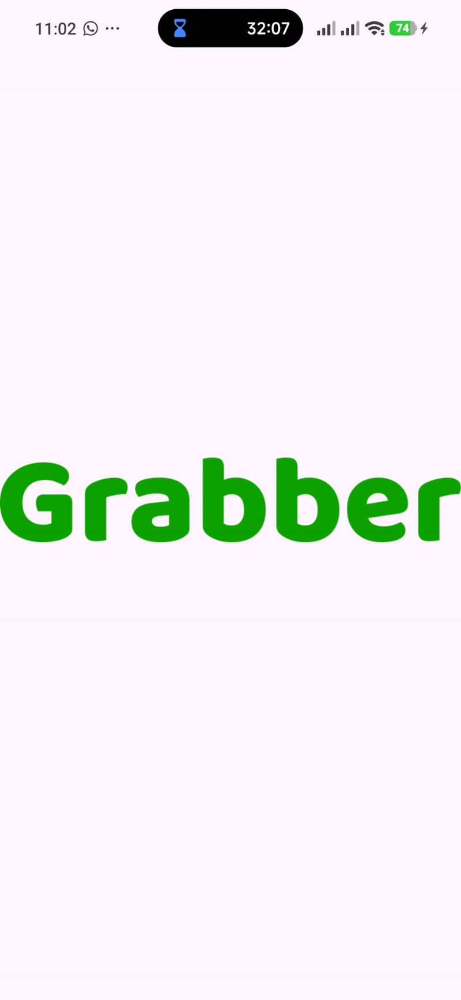

<p align="center">
  
</p>

<h1 align="center">🍓 FRUITY</h1>
<h3 align="center">Fruit E-Commerce UI App built with Flutter</h3>

<p align="center">
  
  
  
</p>

---

## ✨ About the Project

**FRUITY** is my **first Flutter project**, focused on building a clean and modern  
**fruit-only e-commerce UI**.

This project was built to practice:
- Flutter layouts
- Widget composition
- Navigation & screen flow
- Clean UI structure

> ⚠️ **Note:**  
> This is a **Frontend-only project** — no backend, API, or database.

---

## 🎥 App Preview

<p align="center">
  
</p>


---

## 🛠️ Tech Stack

- Flutter
- Dart
- Material Design
- Custom Widgets
- Responsive UI

---

## 📂 Project Structure

```text
📁 images
│   ├── 📁 Icons
│   │   ├── 🖼️ card.svg
│   │   ├── 🖼️ mottor.svg
│   │   ├── 🖼️ star.png
│   │   └── 🖼️ star.svg
│   ├── 📁 banners
│   │   ├── 🖼️ Slider1.png
│   │   ├── 🖼️ Slider2.png
│   │   └── 🖼️ Slider3.png
│   ├── 📁 category
│   │   ├── 🖼️ clothes.png
│   │   ├── 🖼️ food.png
│   │   ├── 🖼️ fruits.png
│   │   ├── 🖼️ milk.png
│   │   ├── 🖼️ things-in-cart.png
│   │   └── 🖼️ vegitables.png
│   ├── 📁 fruits
│   │   ├── 🖼️ banana.png
│   │   ├── 🖼️ orange.png
│   │   └── 🖼️ papper.png
│   └── 📁 logo
│       └── 🖼️ logo.png
📁 lib
│   ├── 📄 colors.dart
│   ├── 📄 home.dart
│   ├── 📄 main.dart
│   ├── 📄 model.dart
│   ├── 📄 product_items.dart
│   └── 📄 splash_screen.dart
